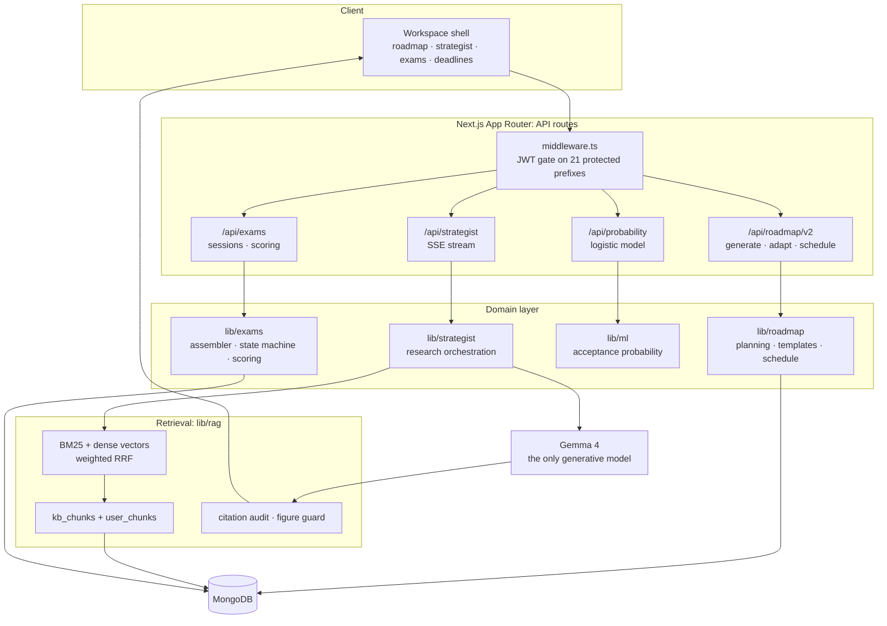

# Polaris

**A bilingual academic strategy platform that turns a student's goals, scores, and deadlines into a living admissions roadmap, and keeps it honest.**

Polaris plans a multi-year path to a target university, breaks it into weekly work, and puts a retrieval-grounded AI Strategist next to it that cites its sources and is checked for fabricated figures before it finishes answering.

Built with Next.js 15, React 19, TypeScript, MongoDB, and a hybrid BM25 + dense-vector retrieval layer.


> **Redirect repository notice:** `ImtiazHossain-Eshan/Polaris` is the lightweight Vercel redirect shell for the legacy deployment URL. `https://polaris-zcq9.vercel.app/` permanently redirects to the live Polaris Academy deployment at `https://polaris-ai-academy.vercel.app/`. The full application source remains in [`DesignNovae/Polaris`](https://github.com/DesignNovae/Polaris); this repository intentionally does not duplicate that application code.

---

## Table of contents

- [Why Polaris](#why-polaris)
- [Live deployments](#live-deployments)
- [Quick start](#quick-start)
- [Product tour](#product-tour)
- [Architecture](#architecture)
- [Retrieval and grounding](#retrieval-and-grounding)
- [Technology](#technology)
- [Repository structure](#repository-structure)
- [Configuration](#configuration)
- [Commands](#commands)
- [Testing and verification](#testing-and-verification)
- [Deployment](#deployment)
- [Security and privacy](#security-and-privacy)
- [Known limits](#known-limits)

---

## Live deployments

| URL | Role |
| --- | --- |
| [`polaris-ai-academy.vercel.app`](https://polaris-ai-academy.vercel.app/) | Current Polaris Academy application |
| [`polaris-zcq9.vercel.app`](https://polaris-zcq9.vercel.app/) | Legacy URL; HTTP 308 redirect to the current application |

The redirect is configured in [`vercel.json`](vercel.json) and preserves incoming paths and query strings, so `/demo?from=legacy` becomes `https://polaris-ai-academy.vercel.app/demo?from=legacy`.

---

## Why Polaris

Most admissions tools do one of three things: store a checklist, answer questions from a chatbot, or sell a consultant. Polaris connects them, and treats the AI as something that has to be *verifiable* rather than merely fluent.

| Design decision | What it means in practice |
| --- | --- |
| The plan is the product | The roadmap is a real data structure (yearly missions, milestones, weekly tasks), not a chat transcript. Everything else reads from and writes to it. |
| Grounded, not generative-only | The Strategist retrieves from a shared knowledge base and the student's own record, then cites what it used. Retrieval is measured, not assumed. |
| Answers are checked before they land | A deterministic citation audit and an unsupported-figure guard run over every answer; the figure guard emits a visible warning rather than silently passing. |
| Degrade, never break | No embeddings, no `TAVILY_API_KEY`, no reranker, no MongoDB: each absence downgrades a capability instead of failing the request. |
| Gates live in code | Plan limits and feature access are enforced server-side (`lib/features.ts`), not by hiding buttons. |

---

## Quick start

### Prerequisites

- **Node.js 22 or newer** (developed on 26; `scripts/screenshots.mjs` needs the global `WebSocket` from Node 22+)
- npm
- MongoDB, only for the authenticated workspace
- A Google AI Studio API key, only for AI features

### Fastest path: the demo, with no database

```bash
git clone https://github.com/DesignNovae/Polaris.git
cd Polaris
npm install
npm run dev
```

Open **`http://localhost:3000/demo`**. Every workspace surface renders from seeded data with no MongoDB, no API key, and no sign-up. This is also what the screenshots below are captured from.

### Full workspace

```bash
cp .env.local.example .env.local     # PowerShell: Copy-Item .env.local.example .env.local
```

Set at minimum:

```bash
MONGODB_URI=...                          # authenticated features
NEXT_PUBLIC_CLERK_PUBLISHABLE_KEY=...    # Clerk dashboard -> API keys
CLERK_SECRET_KEY=...                     # server-side, never exposed
GEMMA_API_KEY=...                        # AI features + embeddings
```

Then ingest the retrieval corpus and start:

```bash
npm run rag:ingest
npm run dev
```

---

## Product tour

### Adaptive roadmap

A goal becomes yearly missions, missions become milestones, and milestones become a weekly schedule. Changing a constraint replans the tree rather than resetting it.


### Grounded Strategist

Streams profile-aware guidance over SSE. Every turn carries the student's profile, roadmap, extracted memory, retrieved knowledge-base passages, and, on request, live web results, with citations back to each source.


### University intelligence

Sourced universities with dated official data, filters, and an acceptance-probability model that starts from each school's published rate and adjusts it from academic inputs only, with no demographic features.


### Action Lab

Seven tools for turning intent into evidence: Decision Twin, Evidence Graph, Exam Lab, Smart Routine, Video Learning, Knowledge Notes, and Essay Studio.

The **Decision Twin** stress-tests a constraint change ("my SAT date moved six weeks earlier") and shows the acceptance probability before and after, next to a diff of what the plan would do differently.


The **Evidence Graph** maps a claim to the artifact that proves it, then names the verified signal, the remaining gap, and the next action. Claims with nothing behind them are surfaced rather than quietly counted.


**Smart Routine** turns the roadmap and a declared weekly capacity into protected time blocks. Blocks are added in natural language ("add math practice on Monday from 9 to 10 pm") or through the manual editor, and every generated block stays editable.


**Exam Lab** runs timed mock exams with autosave and recovery. The catalog covers a SAT Math module, a full adaptive SAT of four modules plus a break, and all four IELTS papers. An interrupted attempt shows as *Resume* instead of being lost.


**AI Practice** generates a fresh original practice set for a chosen exam, section, difficulty and target skill. The disclaimer belongs to the product rather than this README: these are original unofficial questions and do not predict an official IELTS band or SAT score.


**Essay Studio** captures Bengali, English or mixed handwriting and extracts it into an editable draft, preserving the original language and paragraphing. The uploaded image is not stored, it is processed only for the active extraction request. The coach returns feedback, refinement and outline suggestions rather than rewriting the essay.


**Video Learning** collects vetted official lessons for the current section, with an AI lesson finder that refreshes the list. A sign language interpreter track can be toggled on for the player.


### Verified Student Passport

One permalinked page a student can send to a teacher, a consultant, or a scholarship committee. Each claim sits beside the artifact that proves it and the date it was verified - and the claims with nothing behind them are listed as unevidenced rather than quietly dropped. That last rule is the point: a page that only shows the good half is a CV with extra steps.

Published passports are unlisted (`noindex`, random slug) and excluded from the sitemap. `/passport` builds it; `/p/<slug>` is the public view.

### Cohort benchmarking

Where a student stands against anonymised students targeting the same tier, as a distribution rather than a leaderboard. A cohort under **20 students never renders** - not blurred, not approximated. In a group that small a percentile tells you someone else's score, so the API returns `suppressed` and the UI explains the rule. The aggregation projects four numbers per profile and no identifiers.

### Affordability planner

The question that actually decides a Bangladeshi family's list, answered in taka: total cost after aid, the funding gap named as a figure, and the scholarships ranked by how much of that gap they would close. Living costs are the official visa and maintenance figures with their source links; tuition is a published-range estimate and is labelled `estimate` everywhere it appears. The two are never blurred together.

### Exam results rewrite the plan

Finishing a mock now proposes a change to next week's blocks - which to add, which to deprioritise, and the arithmetic behind each ("48% on Heart of Algebra vs 71% overall"). It is deterministic, it proposes rather than applies, and accepting the same proposal twice is a no-op.

### Teacher and recommender portal

The link model extends to teachers, with a **narrower** scope than a parent: the evidence behind each claim, the academic record, and the deadlines that constrain the letter - and nothing else. Scope is enforced once on the server (`lib/links/scope.ts`), so a component cannot widen it by forgetting. Strategist conversations are never shared with anyone, in any role.

### Deadline reminders that leave the app

Risk-scored deadlines reach students by email and SMS rather than only in a tab they have to remember to open. Each (user, deadline, channel, day-offset) fires exactly once, enforced by a unique index rather than a flag - and the log row is claimed *before* the send, because a duplicate text at 6am is worse than a missed one when the deadline is visible in the app anyway.

### Works on a bad connection

A service worker caches the workspace shell and the read APIs a student needs offline; anything authenticated and mutating, anything from the model, and anything to do with payments is never cached. Exam answers written offline queue in IndexedDB and replay on reconnect. `/changelog` records what shipped.

### Knowledge hub

Composite admit stories, real scholarships with official links, and sourced cost benchmarks. This is the same corpus the Strategist retrieves from.


### Connected progress

Read-only-by-default integrations with explicit scopes and one-click revocation. Connected data sharpens the roadmap, deadlines, and fit analysis.


> Most screenshots are reproducible: `npm run dev`, then `npm run screenshots`. Those render only public `/demo` routes, so no real student data reaches a committed image. The four Exam Lab, AI Practice, Essay Studio and Video Learning captures are the exception: those surfaces load from authenticated endpoints, so they were taken from a signed-in session and cannot be regenerated by the script.

Also included and not pictured: deadline command with risk scoring, Knowledge Notes, community channels, consultant marketplace and bookings, family/monitor visibility, billing, and an admin console.

---

## Architecture



**The Strategist turn**, in order: plan queries (rewriting follow-ups into standalone questions) → retrieve from the shared KB and the student-scoped index in parallel → optionally rerank → fire a second pass if the best passage is below the similarity threshold → drop retrieval entirely if it found nothing relevant → stream the answer → audit citations and scan for unsupported figures.

That last step matters: when retrieval genuinely has nothing, Polaris hands the model an empty context so it declines, rather than letting it answer from parametric memory and cite nothing.

---

## Retrieval and grounding

Retrieval quality is measured, not asserted. Baselines over 50 labelled queries spanning 5 query kinds against 114 indexed chunks:

| Retriever | R@1 | R@3 | R@5 | MRR |
| --- | --- | --- | --- | --- |
| Lexical (BM25 only) | 0.640 | 0.780 | 0.860 | 0.726 |
| Vector only | 0.880 | 0.960 | 0.980 | 0.925 |
| **Hybrid (default)** | 0.840 | 0.980 | 0.980 | 0.897 |
| Hybrid + LLM rerank | 0.940 | 0.960 | 0.980 | 0.955 |

Reranking wins on R@1 and MRR but not on R@5, and the Strategist passes all five passages to the model either way, so it ships **off**, costing one fewer model call per turn. Flip `RAG_RERANK=on` if answer quality turns out to depend on passage order.

Generation-side checks (n=8):

| Metric | Result |
| --- | --- |
| Citation precision | 0.957 |
| Malformed citation URIs | 0 |
| Unsupported figures | 0 |
| Groundedness (LLM judge) | 0.903 |
| Answer relevance | 1.000 |

The groundedness judge is itself calibrated against labelled fixtures (0.800 detection, 0.000 false-alarm rate), because a model grading a model is worth nothing until you know its error rate.

Full design, failure behaviour, and the measurement caveats are in **[docs/RAG.md](docs/RAG.md)**.

---

## Technology

| Area | Implementation |
| --- | --- |
| Application | Next.js 15 App Router, React 19, TypeScript 5 |
| Styling and motion | Tailwind CSS, Framer Motion, GSAP, Lenis |
| Authentication | Clerk (hosted sign-in, enforced email verification, MFA); application role and plan resolved in `lib/authz.ts` |
| Data | MongoDB 7 driver |
| Validation | Zod 4 on API input |
| Generation | Gemma 4 (`gemma-4-26b-a4b-it` default, `gemma-4-31b-it`) via Google AI Studio, streamed over SSE |
| Retrieval | `gemini-embedding-001` @ 768 dims + BM25, fused with weighted RRF |
| Rate limiting | Upstash Redis sliding window, with a lossy in-process fallback |
| Payments | SSLCommerz hosted checkout with server-side validation and IPN (optional) |
| Content | react-markdown, GFM, KaTeX |

**On model policy:** Gemma 4 is the only model that generates language. The embedding model is a non-generative retriever and the web-search provider returns documents, not prose. Both are retrieval components, not second authors.

---

## Repository structure

```text
app/
  (app)/                Authenticated workspace shell: roadmap, strategist, exams, ...
  (auth)/               Sign in / sign up / sign out
  (exam)/               IELTS and SAT runners
  admin/                Content, knowledge, roadmaps, users
  demo/                 Public seeded demo, no database required
  api/                  81 route handlers
components/             Product, workspace, landing, and shared UI
data/                   Seed universities, scholarships, case studies, RAG eval set
docs/                   RAG.md and product screenshots
lib/
  action-lab/           Action Lab data and contracts
  admissions/           Admissions requirements and gap analysis
  billing/              Plan catalog and subscription services
  db/                   MongoDB collections and indexes
  exams/                Item bank, assembler, state machine, scoring
  i18n/                 English / Bengali localization
  integrations/         External provider registry and OAuth flows
  llm/                  Model routing, provider adapters, web search
  affordability/        Cost model + scholarship gap ranking
  cohort/               k-anonymous benchmarking statistics
  links/                Viewer scope policy (parent / partner / teacher)
  ml/                   Acceptance-probability model
  notifications/        Reminder channels, scheduling, dispatch
  passport/             Verified Student Passport
  payments/             SSLCommerz gateway + order settlement
  rag/                  Chunking, embeddings, hybrid search, eval, guards
  roadmap/              Planning, templates, scheduling, telemetry
  strategist/           Research orchestration, prompts, tools, memory, streaming
scripts/                RAG ingestion / eval / calibration, screenshots, benchmarks
tests/                  Node test-runner suites
```

---

## Configuration

`.env.local.example` is the source of truth. Never commit `.env.local`.

### Core

| Variable | Required for | Purpose |
| --- | --- | --- |
| `MONGODB_URI` | Workspace | Connection string. `/demo` works without it. |
| `NEXT_PUBLIC_CLERK_PUBLISHABLE_KEY` | Workspace | Clerk publishable key. Public by design. |
| `CLERK_SECRET_KEY` | Workspace | Clerk secret key. Server-side only. |
| `CLERK_WEBHOOK_SIGNING_SECRET` | Optional | Svix secret for `/api/webhooks/clerk`. Without it the webhook rejects everything; sessions still provision users on first sign-in. |
| `APP_URL` | Production | Canonical public origin. The payment gateway posts the payer back to absolute URLs built from this, so a wrong value strands completed payments. |
| `GEMMA_API_KEY` | AI features | Google AI Studio key, server-side only. Also powers embeddings. |
| `GEMMA_MODEL` | Optional | `gemma-4-26b-a4b-it` (default) or `gemma-4-31b-it`. Values outside the allowlist fall back to the default. |
| `ADMIN_EMAILS` | Optional | Comma-separated admin allowlist. |

### Retrieval

| Variable | Default | Purpose |
| --- | --- | --- |
| `RAG_EMBEDDINGS` | on | `off` falls back to BM25-only retrieval |
| `RAG_EMBED_MODEL` | `gemini-embedding-001` | changing it invalidates stored vectors |
| `RAG_EMBED_DIM` | `768` | as above, re-run `npm run rag:ingest -- --force` |
| `RAG_VECTOR_WEIGHT` | `1.6` | dense weight during fusion; retune with `npm run rag:eval` |
| `RAG_QUERY_REWRITE` | on | `off` skips follow-up resolution |
| `RAG_RERANK` | off | `on` adds a model call per turn and widens retrieval depth to 15 |
| `RAG_SECOND_PASS` | on | `off` disables the retry on weak retrieval |
| `RAG_SECOND_PASS_THRESHOLD` | `0.6` | cosine below which retrieval counts as having found nothing |
| `RAG_EVAL_RPM` | `12` | request budget for the batch harnesses only, never for request paths |

### Optional services

| Variable | Purpose |
| --- | --- |
| `TAVILY_API_KEY` | Non-generative live-web retrieval in Research mode |
| `UPSTASH_REDIS_REST_URL`, `UPSTASH_REDIS_REST_TOKEN` | Shared rate-limit store, **see the warning below** |
| `GOOGLE_CLIENT_ID`, `GOOGLE_CLIENT_SECRET` | Google Calendar / Classroom **integrations** (not sign-in) |
| `FACEBOOK_CLIENT_ID`, `FACEBOOK_CLIENT_SECRET` | Facebook **integration** (not sign-in) |
| `SSLCOMMERZ_STORE_ID`, `SSLCOMMERZ_STORE_PASSWORD`, `SSLCOMMERZ_SANDBOX` | Hosted checkout, payment validation, IPN. `SSLCOMMERZ_SANDBOX=false` switches to the live gateway. |

> **Rate limiting in production.** Without the two `UPSTASH_*` variables, `lib/ratelimit.ts` falls back to a per-process in-memory window. On serverless that budget is *per instance*, so the effective limit is the configured budget multiplied by the number of warm lambdas. Set Upstash before opening the Strategist to real traffic.

Sign-in is handled by **Clerk**, which owns credentials, email verification, sessions and MFA. The Google and Facebook variables above are consumed by the integrations hub in `lib/integrations/registry.ts` and are unrelated to sign-in.

Rate limits are per-scope rather than one shared budget (`lib/ratelimit.ts`). Strategist chat over a 5-minute window: **free 10**, **pro 30**, **elite 60**; roadmap planning, Action Lab, exam AI and essay OCR each carry their own window and budget. Scopes that front a metered model call **fail closed** when Upstash is configured but unreachable.

---

## Commands

| Command | Purpose |
| --- | --- |
| `npm run dev` | Development server |
| `npm run build` | Production build |
| `npm run start` | Serve the production build |
| `npm run lint` | ESLint, zero warnings tolerated |
| `npm test` | Node test runner: exam scoring, roadmap contracts, affordability, cohort statistics, reminder scheduling |
| `npm run rag:test` | 38 deterministic retrieval self-tests, no database or network |
| `npm run rag:ingest` | Ingest or refresh the retrieval corpus (`-- --force` re-embeds everything) |
| `npm run rag:eval` | Recall@k and MRR per retriever (`-- --rerank` includes the reranker) |
| `npm run rag:faith` | Citation validity, unsupported figures, groundedness (`-- --n 20` for a stable sample) |
| `npm run rag:calibrate` | Score the groundedness judge against labelled fixtures |
| `npm run screenshots` | Recapture `docs/screenshots/` from a running dev server |
| `npm run benchmark:roadmap` | Roadmap planner benchmark |

In the full application source, scheduled work runs as an HTTP route rather than a worker: `GET /api/cron/deadline-reminders`, authorised by `CRON_SECRET`. This redirect repository's `vercel.json` contains only the permanent redirect rule.

---

## Testing and verification

```bash
npm run lint                          # ESLint, --max-warnings=0
npx tsc --noEmit --incremental false  # full type check
npm test                              # 39 tests
npm run rag:test                      # 38 self-tests
npm run build                         # production build
```

Current state: **all green**: lint clean, types clean, 39/39, 38/38, build compiles.

The suites cover the places where a silent regression would be most expensive: **exam scoring** (whole-word matching, per-stage scoring, rejecting plausible wrong answers), **roadmap contracts** (gap analysis, deterministic priority scoring, duration units), **affordability** (an unmodelled country must report unsupported rather than a zero cost, aid never applies to living costs, the verdict boundary), **cohort statistics** (the k-anonymity floor, bucket coverage, tie handling), and **reminder scheduling** (offsets, past deadlines, unparseable dates, phone normalisation).

The retrieval harnesses are separate because they need network and a database. `rag:test` deliberately does not. It is the one retrieval check that runs anywhere, and it has already caught two real bugs in code that had never executed in production.

---

## Deployment

Before shipping:

- [ ] `npm run lint && npx tsc --noEmit && npm test && npm run rag:test && npm run build` all pass
- [ ] Production secrets set in the deployment environment, not in the repo
- [ ] Vercel has the matching `NEXT_PUBLIC_CLERK_PUBLISHABLE_KEY` and `CLERK_SECRET_KEY` for the selected Clerk instance (`pk_test_`/`sk_test_` for the test instance or `pk_live_`/`sk_live_` for production); the old `NEXTAUTH_*` variables are not used
- [ ] `APP_URL` exactly matches the public origin
- [ ] Clerk webhook points at `/api/webhooks/clerk` (user.created, user.updated, user.deleted)
- [ ] SSLCommerz IPN URL registered in the merchant panel as `<APP_URL>/api/payments/sslcommerz/ipn`
- [ ] `UPSTASH_*` configured, otherwise rate limits are per-instance
- [ ] MongoDB network access allows the deployment. Indexes are created automatically on the first query by `ensureIndexes()` (`lib/db/indexes.ts`, which `getDb()` calls); verify with `db.<collection>.getIndexes()` after the first deploy
- [ ] `npm run rag:ingest` has run since the last change to `RAG_EMBED_MODEL` or `RAG_EMBED_DIM`
- [ ] `ADMIN_EMAILS` set, since the admin console is gated on it
- [ ] `SSLCOMMERZ_SANDBOX=false` and live store credentials set, if billing is on

---

## Security and privacy

- **Credentials stay server-side.** The AI key is never shipped to the browser; the only exception is the explicitly labelled bring-your-own-key flow in Action Lab, where the user supplies their own.
- **Student retrieval rows are scoped by `userId`** at both the store query and a per-row re-check, and `user_chunks` is deleted with the account alongside profiles, roadmaps, memory, chat, and transactions.
- **Protected routes are gated in `clerkMiddleware`** across 21 path prefixes. Cookie naming is Clerk's, so a misconfigured origin can no longer desynchronise the session and bounce signed-in users to `/signin`.
- **Payments are never granted from a callback.** SSLCommerz's return and IPN endpoints are public and unauthenticated, so both re-validate server-to-server and check the amount and currency against the order row written before redirect. Settlement is idempotent, and access ends when the paid term expires rather than when an unrecognised gateway event arrives.
- **API input is validated with Zod**, and plan/role requirements are enforced in the handler.
- **The acceptance model uses academic inputs only**: GPA, test percentile, activity count, research. No demographic features.
- **Cohort statistics are k-anonymous.** A cohort below 20 students returns `suppressed` and renders nothing; the aggregation projects four numbers per profile and no identifiers.
- **Viewer scope is enforced server-side** in `lib/links/scope.ts`. A teacher's payload is materially narrower than a parent's, and Strategist conversations are shared with nobody in any role.
- **Public passports are unlisted, not published**: random slug, `noindex`, excluded from the sitemap, and an unpublished slug behaves exactly like one that never existed.
- **Scheduled routes refuse to run without `CRON_SECRET`**, compared in constant time. An open endpoint that sends real SMS to real students is not something to leave to a default.
- **Integrations are read-only by default**, request explicit scopes, and can be revoked in one click.
- **Answers are audited before they finish**: citation URIs are parsed and verified against what was actually retrieved, and any currency or score figure not present in the supplied context raises a visible warning on the message.

---

## Known limits

Stated plainly, because a README that only lists strengths is a sales page:

- **The knowledge corpus is small**, at 114 chunks. It grows through Admin → Knowledge, which requires an `https` source URL and a verification date for every document. Nothing is auto-generated into it.
- **Groundedness scores are noisy at n=8**, swinging 0.77 to 0.93 across runs with no code change. Use `npm run rag:faith -- --n 20` before believing a prompt change helped. The deterministic metrics (citation precision, figure violations) are stable.
- **The reranker hits free-tier quota** on roughly 2 of 50 eval queries even with pacing. In production it degrades silently to fused order by design.
- **Vector search is a brute-force cosine scan** in Node, not Atlas `$vectorSearch`. It is exact and tier-independent, but linear in corpus size. It is fine at this scale and will need revisiting well before six figures of chunks.
- **No CI pipeline and no licence file yet.** The verification commands above are run manually.

---

## Further documentation

- [Retrieval and grounding design](docs/RAG.md)
- [Environment template](.env.local.example)
- [Feature access map](lib/features.ts)
- [Plan catalog](lib/billing/plans.ts)

---

## Status

Polaris is under active development. Interfaces, pricing, and integration behaviour may change while the platform is being prepared for production deployment.
